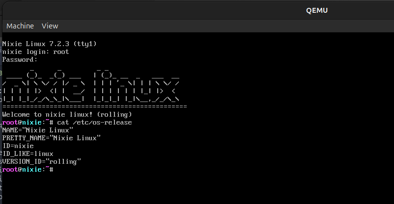

# nixie-linux
its real

## build
1. `$ bash tools/install-reqs.sh`
2. `$ sudo bash build.sh`
3. thats it. you have to wait a millenial

right only, only a rootfs will be built. iso builder script is in progress
