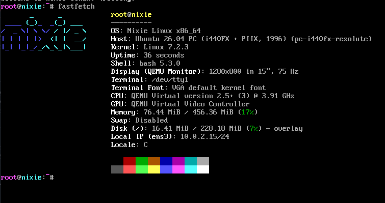

# nixie-linux
its real

## build
1. `$ bash tools/install-reqs.sh`
2. `$ sudo bash build.sh`
3. `$ sudo tools/00-isobuild.sh`

the iso builder is complete :D

builds a file called `nixie-linux.iso`

Note: couldnt get autologin workin in time so the login is `root` with password `1`

